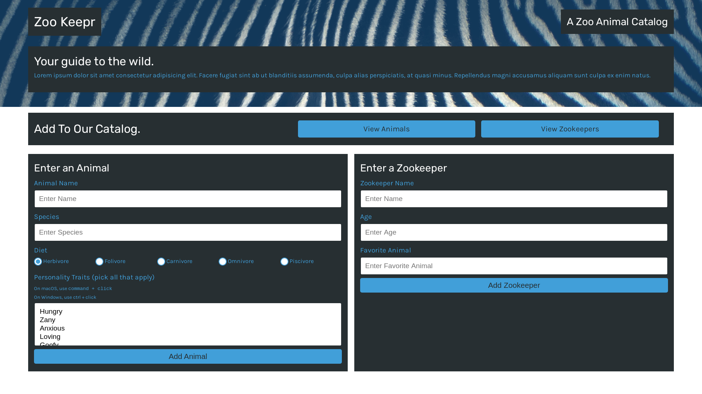
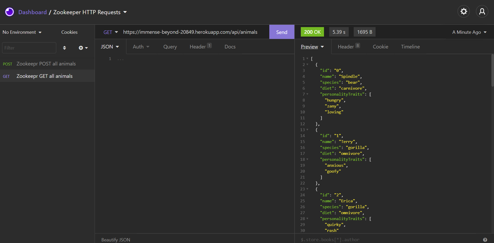

# Zookeepr

# Description

In this module, I created a web server that used the Express.js framework and added it to a front-end application that the local zoo is developing, called Zoo Keepr. The site’s data will live on the server I built so that anyone can access it without having to download it. I also deployed my application to Heroku, a cloud application platform that allows you to deploy applications with servers to a webpage.





# Pre-requisites

- Install [Node.js](https://nodejs.org/en/) version 8.0.0

# Getting started

- Clone the repository

```
git clone <git@github.com:shanebramble/zookeepr.git> 
```

- Install dependencies

```
cd <project_name>
npm install
```

- Build and run the project

```
npm start
```

### Deployed Website

<https://immense-beyond-20849.herokuapp.com/>

### Built With

- JavaScipt
- Node.js

## Contribution

Made with ❤️ by Shane Bramble-Wade

### ©️2021 Zookeepr, Inc
